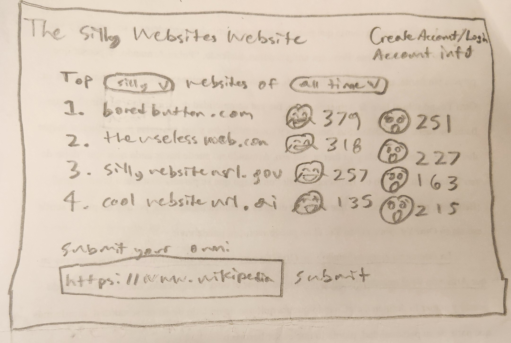
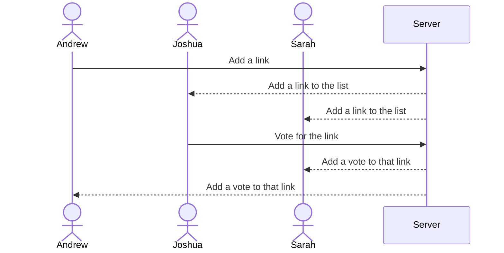

# The Silly Websites Website

[My Notes](notes.md)

This project is going to be a website where users can share links to silly websites and vote on their favorite silly websites.

## 🚀 Specification Deliverable

For this deliverable I did the following. I checked the box `[x]` and added a description for things I completed.

- [x] Proper use of Markdown
- [x] A concise and compelling elevator pitch
- [x] Description of key features
- [x] Description of how you will use each technology
- [x] One or more rough sketches of your application. Images must be embedded in this file using Markdown image references.

### Elevator pitch

There are a lot of silly and interesting websites on the web, and sometimes it can be hard to find the one you saw a few years ago, or maybe you've got a few minutes to fill before catching the bus and you want something quick to entertain you. My website will be a link sharing website where users can share links to their favorite silly and interesting websites, and then can vote on the ones submitted by everyone else that they think are the most funny and interesting. 

### Design

Here is a sequence diagram that shows how users will interact with the backend to add links and vote on them

### Key features

- Secure login over HTTPS 
- Ability to submit new links to the database
- Ability to see links you have previously submitted
- Ability to browse links by total votes from users
- Ability to vote for links that users find funny or interesting
- Ability to see links you have voted for in the past
- Votes and links are stored in a database allowing for them to remain over time and continue to gain votes
- Ability for administrators to remove links from the database that are inappropriate or offensive

### Technologies

I am going to use the required technologies in the following ways.

- **HTML** - Uses correct HTML structure for application. Two HTML pages. One for browsing the links and one for seeing your account information and history.
- **CSS** - Styling that looks good on different screen sizes, is easy to navigate, and color choice that is modest and not distracting
- **React** - Provides login, display of links, applying votes to links, displaying other user's votes, and for routing and components
- **Service** - Backend service with endpoints for:
    - login
    - retrieving links
    - voting on links
    - retrieving vote status
    - linkpreview api to generate previews of links
- **DB/Login** - Store users, the links they have submitted, the links they have liked, as well as how many likes each link has. Users cannot vote unless signed in to an account, and account credentials are store securely in the database.
- **WebSocket** - As users add links and vote on them, the results are broadcast to other users on the site.

## 🚀 AWS deliverable

For this deliverable I did the following. I checked the box `[x]` and added a description for things I completed.

- [x] **Server deployed and accessible with custom domain name** - [My server link](https://i-wanna-share-this.link/).

## 🚀 HTML deliverable

For this deliverable I did the following. I checked the box `[x]` and added a description for things I completed.

- [x] **HTML pages** 
- [x] **Proper HTML element usage** 
- [x] **Links** 
- [x] **Text**
- [x] **3rd party API placeholder**
- [x] **Images**
- [x] **Login placeholder**
- [x] **DB data placeholder**
- [x] **WebSocket placeholder**

## 🚀 CSS deliverable

For this deliverable I did the following. I checked the box `[x]` and added a description for things I completed.

- [ ] **Header, footer, and main content body** - I did not complete this part of the deliverable.
- [ ] **Navigation elements** - I did not complete this part of the deliverable.
- [ ] **Responsive to window resizing** - I did not complete this part of the deliverable.
- [ ] **Application elements** - I did not complete this part of the deliverable.
- [ ] **Application text content** - I did not complete this part of the deliverable.
- [ ] **Application images** - I did not complete this part of the deliverable.

## 🚀 React part 1: Routing deliverable

For this deliverable I did the following. I checked the box `[x]` and added a description for things I completed.

- [ ] **Bundled using Vite** - I did not complete this part of the deliverable.
- [ ] **Components** - I did not complete this part of the deliverable.
- [ ] **Router** - Routing between login and voting components.

## 🚀 React part 2: Reactivity

For this deliverable I did the following. I checked the box `[x]` and added a description for things I completed.

- [ ] **All functionality implemented or mocked out** - I did not complete this part of the deliverable.
- [ ] **Hooks** - I did not complete this part of the deliverable.

## 🚀 Service deliverable

For this deliverable I did the following. I checked the box `[x]` and added a description for things I completed.

- [ ] **Node.js/Express HTTP service** - I did not complete this part of the deliverable.
- [ ] **Static middleware for frontend** - I did not complete this part of the deliverable.
- [ ] **Calls to third party endpoints** - I did not complete this part of the deliverable.
- [ ] **Backend service endpoints** - I did not complete this part of the deliverable.
- [ ] **Frontend calls service endpoints** - I did not complete this part of the deliverable.

## 🚀 DB/Login deliverable

For this deliverable I did the following. I checked the box `[x]` and added a description for things I completed.

- [ ] **User registration** - I did not complete this part of the deliverable.
- [ ] **User login and logout** - I did not complete this part of the deliverable.
- [ ] **Stores data in MongoDB** - I did not complete this part of the deliverable.
- [ ] **Stores credentials in MongoDB** - I did not complete this part of the deliverable.
- [ ] **Restricts functionality based on authentication** - I did not complete this part of the deliverable.

## 🚀 WebSocket deliverable

For this deliverable I did the following. I checked the box `[x]` and added a description for things I completed.

- [ ] **Backend listens for WebSocket connection** - I did not complete this part of the deliverable.
- [ ] **Frontend makes WebSocket connection** - I did not complete this part of the deliverable.
- [ ] **Data sent over WebSocket connection** - I did not complete this part of the deliverable.
- [ ] **WebSocket data displayed** - I did not complete this part of the deliverable.
- [ ] **Application is fully functional** - I did not complete this part of the deliverable.
